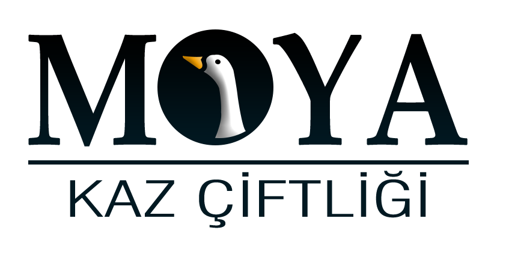
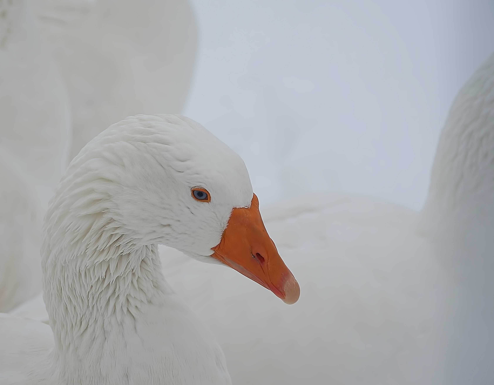
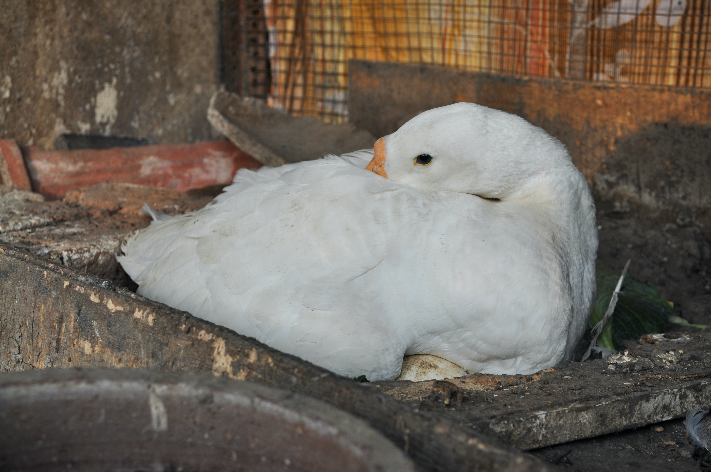
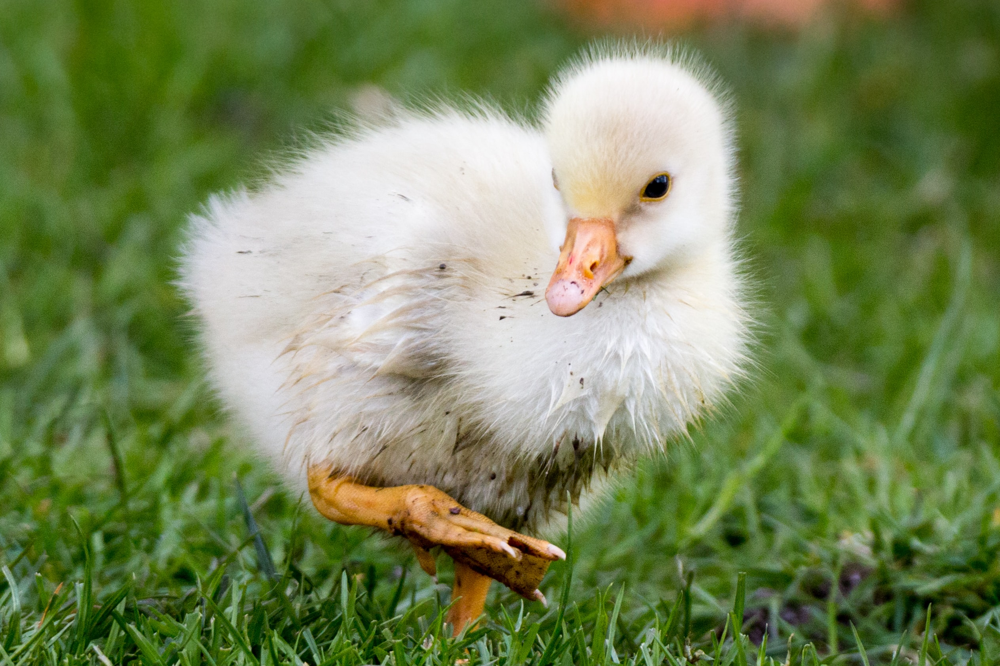
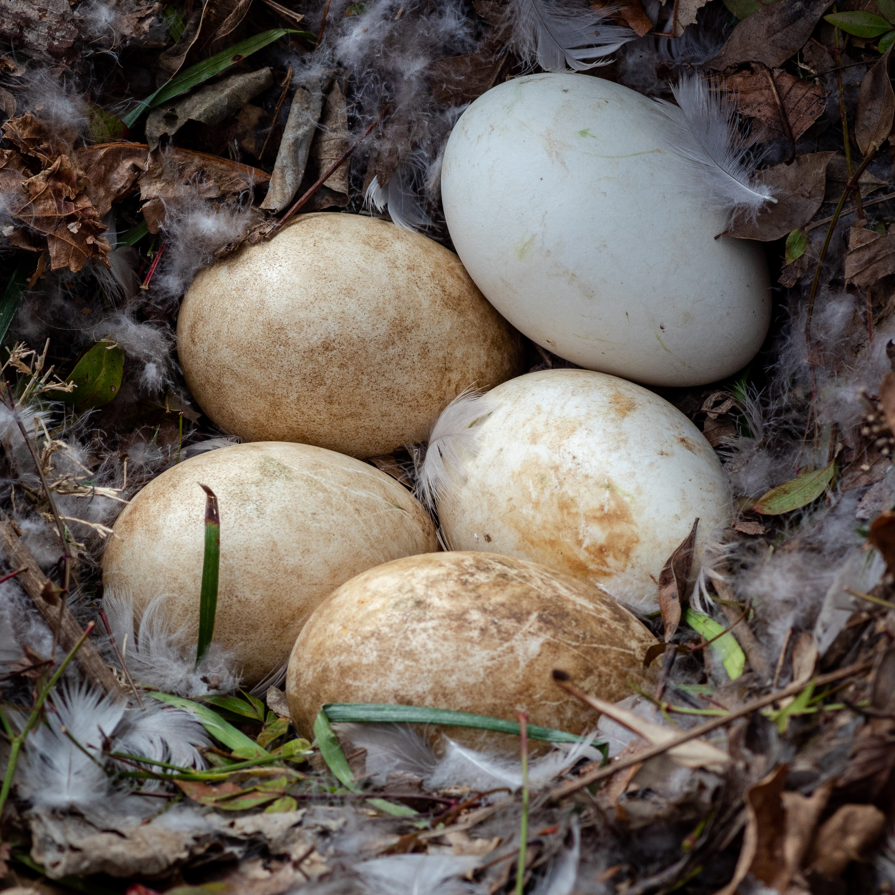
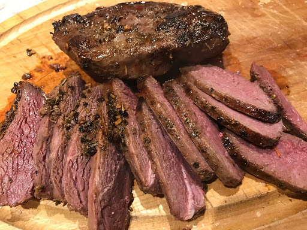
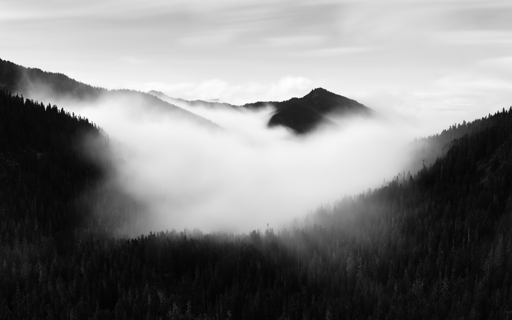

<!DOCTYPE html>
<html lang="en">

<head>
    <meta charset="utf-8" />
    <meta name="viewport" content="width=device-width, initial-scale=1, shrink-to-fit=no" />
    <meta name="description" content="" />
    <meta name="author" content="" />
    <title>Moya Kaz Çiftliği</title>
    <link rel="icon" type="image/x-icon" href="assets/img/logo.png" />
    <!-- Font Awesome icons (free version)-->
    
    <!-- Google fonts-->
    <link href="https://fonts.googleapis.com/css?family=Varela+Round" rel="stylesheet" />
    <link
        href="https://fonts.googleapis.com/css?family=Nunito:200,200i,300,300i,400,400i,600,600i,700,700i,800,800i,900,900i"
        rel="stylesheet" />
    <!-- Core theme CSS (includes Bootstrap)-->
    <link href="css/styles.css" rel="stylesheet" />

    <link href="https://fonts.googleapis.com/css?family=Muli:300,400,500,600,700,800,900&display=swap" rel="stylesheet">
    <link href="https://fonts.googleapis.com/css?family=Oswald:300,400,500,600,700&display=swap" rel="stylesheet">
    <link rel="stylesheet" href="css/font-awesome.min.css" type="text/css">
    <link rel="stylesheet" href="css/flaticon.css" type="text/css">
    <link rel="stylesheet" href="css/owl.carousel.min.css" type="text/css">
    <link rel="stylesheet" href="css/barfiller.css" type="text/css">
    <link rel="stylesheet" href="css/magnific-popup.css" type="text/css">
    <link rel="stylesheet" href="css/slicknav.min.css" type="text/css">
    <link rel="stylesheet" href="css/style.css" type="text/css">
    <link href="css/styles.css" rel="stylesheet" />

</head>

<body id="page-top">
    <!-- Navigation-->

    <nav class="navbar navbar-expand-lg navbar-light fixed-top" id="navbar">
        
        <button class="navbar-toggler navbar-toggler-right" type="button" data-toggle="collapse"
            data-target="#navbarResponsive" aria-controls="navbarResponsive" aria-expanded="false"
            aria-label="Toggle navigation">

            <i class="fas fa-bars"></i>
        </button>
        

            

                <a class="btn btn-outline-success my-2 my-sm-0 " id="navbarButtons" href="#about">Hakkımızda</a>
                <a class="btn btn-outline-success my-2 my-sm-0" id="navbarButtons" href="#products">ÜRÜNLERİMİZ</a>
                <a class="btn btn-outline-success my-2 my-sm-0 " id="navbarButtons" href="#gallery">GALERİ</a>

                <a class="btn btn-outline-success my-2 my-sm-0 " id="navbarButtons" href="#contact">İLETİŞİM</a>
                <a class="btn btn-outline-success my-2 my-sm-0 " id="navbarButtons" href="tel:+905335771725">
                    Hemen Ara <i class="fas fa-phone"></i>

                    
                </a>
            

        

    </nav>
    <!-- Masthead-->

    <section id="Home">
        <header class="masthead">
            

                

                    <h1 class="mx-auto my-0 text-uppercase">MOYA KAZ</h1>

                

            

        </header>
    </section>
    <!-- About-->
    <section class="about-section text-center" id="about">
        

            

                

                    <h2 class="text-white mb-4">Hakkımızda</h2>
                    

                        MOYA Kaz Çiftliği, 2020 yılında Aydın’da yaklaşık 50 dönüm arazi üzerine kurulmuştur. Bir yıllık
                        ARGE ve fizibilite çalışmaları sonrasında, geleneksel yöntemler son teknoloji ile entegre
                        edilmiştir. Çiftliğimizde kaz yetiştiriciliği, veteriner kontrolünde gerçekleştirilmektedir.
                        Yetiştirilen kaz kapasitesine uygun olarak kazların kendi  doğal ortamlarında, otlak alanlarında
                        yayılım üzerine beslenmesi  sağlanmaktadır. Kazların doğal ve organik beslenmelerine özen
                        gösterilmektedir. Çiftliğimizde yumurta ve civciv üretimi de son teknoloji kuluçka
                        makinaları kullanılarak yapılmaktadır.
                    

                

            

        

    </section>
    <!-- Projects-->
    <section class=" projects-section bg-light" id="products">
        

            <h1>Ürünlerimiz</h1>
            <!-- Project One Row-->
            

                

                

                    

                        

                            

                                <h4 class="text-white">Mast Kazı</h4>
                                
Mast kazı Almanya’da hem et, hem yumurta, hem yemden
                                    yararlanma, hem et lezzeti, hem yaşama gücü, hem döl verimi ve çıķım oranı gibi
                                    özelliklerde geliştirilmiş bir ırktır.

                                    Et verimi 5-6 aylık periyotta 6-8 kg canlı ağırlığa ulaşmakla birlikte daha sonraki
                                    ay ve yaşlarda 10-11 KG a kadar artmaktadır.

                                

                            

                        

                    

                

            

            <!-- Project Two Row-->
            

                

                

                    

                        

                            

                                <h4 class="text-white">Damızlık Mast Kazı</h4>
                                

                                    Yumurta verimi 60-70 civarında olup bu sayı bahar dönemi yumurta sayısıdır.
                                    Sonbaharda italyan beyazı ırkı gibi tekrardan yumurtlama özelliği vardır. Bu olay da
                                    mast kazının ebeveynleri arasında italyan beyazı ırkının da olduğu
                                    değerlendirilmektedir.
                                

                                

                            

                        

                    

                

            

            <!--project thirt row-->

            

                

                

                    

                        

                            

                                <h4 class="text-white">Mast Kazı Civcivi</h4>
                                
Mast kazı civcivleri yaklaşık olarak 90 günde 5-6
                                    kilograma kadar ulaşabilirler.

                                

                            

                        

                    

                

            

            <!-- Project Two Row-->
            

                

                

                    

                        

                            

                                <h4 class="text-white">Mast Kazı Yumurtası</h4>
                                
Mast kazı yumurtası, en çok protein içeren yumurta
                                    türlerinden birisidir. Yaklaşık olarak 100gr'da 14gr protein bulunmaktadır. 

                                

                            

                        

                    

                

            

            <!--project thirt row-->

            

                

                

                    

                        

                            

                                <h4 class="text-white">Mast Kazı Eti</h4>
                                
Kazı eti, tavuk gibi diğer kümes hayvanlarından daha
                                    lezzetlidir. Göürünüm ve lezzet olarak kırmızı ete daha yakındır. 

                                

                            

                        

                    

                

            

        

    </section>

    <section class="gallery-section gallery-page" id="gallery">
        

            

            

                
            

            

                
            

            

                
            

            

                
            

            

                
            

            

                

                    <iframe class="embed-responsive-item" width="949" height="534"
                        src="https://www.youtube.com/embed/xN4GMBA9lJo" frameborder="0"
                        allow="accelerometer; autoplay; clipboard-write; encrypted-media; gyroscope; picture-in-picture"
                        allowfullscreen></iframe>
                

            

        

    </section>
    <!--BLOG SECTİON
    <section class=" projects-section bg-light" id="blog">
        

            

                

                

                    

                        <h4>Shoreline</h4>
                        
Grayscale is open source and MIT licensed. This means you can
                            use
                            it for any project - even commercial projects! Download it, customize it, and publish
                            your
                            website!

                    

                

            

        

    </section>
    -->
    <!-- Signup-->
    <!--<section class="signup-section" id="signup">
        

            

                

                    <i class="far fa-paper-plane fa-2x mb-2 text-white"></i>
                    <h2 class="text-white mb-5">Subscribe to receive updates!</h2>
                    <form class="form-inline d-flex">
                        <input class="form-control flex-fill mr-0 mr-sm-2 mb-3 mb-sm-0" id="inputEmail" type="email"
                            placeholder="Enter email address..." />
                        <button class="btn btn-primary mx-auto" type="submit">Subscribe</button>
                    </form>
                

            

        

    </section> -->
    <!-- Contact-->
    <section class="contact-section bg-black" id="contact">
        

            

                

                    

                        

                            <i class="fas fa-map-marked-alt text-primary mb-2"></i>
                            <h4 class="text-uppercase m-0">Adres</h4>
                            

                            
İncirliova / AYDIN

                        

                    

                

                

                    

                        

                            <i class="fas fa-envelope text-primary mb-2"></i>
                            <h4 class="text-uppercase m-0">Email</h4>
                            

                            
info@moyakazciftligi.com

                        

                    

                

                

                    

                        

                            <i class="fas fa-mobile-alt text-primary mb-2"></i>
                            <h4 class="text-uppercase m-0">Telefon</h4>
                            

                            
+90 (533) 577 17 25

                        

                    

                

            

        

    </section>
    <!-- Footer-->
    <footer class="footer bg-black small text-center text-white-50">
        
Copyright © Moya Kaz 2020

    </footer>
    <!-- Bootstrap core JS-->
    
    
    <!-- Third party plugin JS-->
    
    <!-- Core theme JS-->
    

    <!-- Js Plugins -->
    
    
    
    
    
    
    
</body>

</html>
